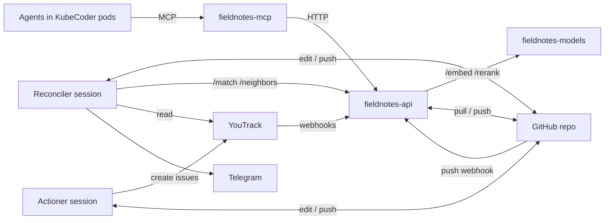
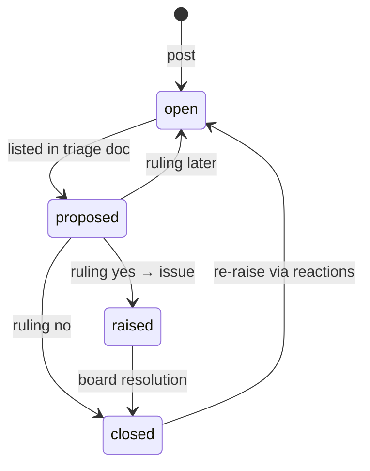

# Fieldnotes — observation store for agents: design note

2026-09-18 · @Someone

## Purpose

Fieldnotes replaces agent memory with a curated, cross-project store: the observations agents currently leave in close-out reports, where they are ignored, go here instead. Agents post an observation; the server answers with likely duplicates and their reaction counts, which the agent reacts to instead of re-posting. That post-time answer makes Fieldnotes a just-in-time knowledge base without any search tool.

A scheduled reconciler curates the store, researches selected observations, checks the board, and writes a triage document. The human rules; an actioner session turns rulings into YouTrack issues and recorded decisions. Observations close when the board says the work is done or won't be done.

The project's input is a dataset Pieter builds from observations in close-out reports of earlier executions; it seeds the store and drives the match evaluation. Minimal by design: one model pod, one small REST service, one thin MCP server, three skills in a git repo. Working names: the store is Fieldnotes, an item is an observation.

## Decisions

The value sits in the reconciler and in the post-time duplicate response; capture is plumbing. Everything below follows from that.

| Topic | Decision | Rationale |
| --- | --- | --- |
| Scope | Three bins for the reporting agent: in scope → do it; out of scope and urgent → close-out report, flagged; out of scope and not urgent → pile. Refactoring opportunities stay in close-out reports. | Ownership is something the reporter can judge; severity is not. Fieldnotes is cross-project memory with an editor, not a tech-debt register. |
| Category | `Enum hint / idea / friction, no bug`, non-normative; the reconciler may recategorize. | A forcing function: the reporter must articulate the observation as one thing. Product bugs go to the operator through the close-out report; friction covers environment and harness cost. |
| Duplicates | `post` returns up to 3 candidates (open and closed) with their reaction counts and does not create; the reporter reacts, or creates with `force`. | This response is the knowledge-delivery moment. Closed items stay matchable so recurrence becomes a re-raise signal. |
| Reactions | One tool `react(id, emoji, text?, source)`; emoji uncurated, allows 👎. | Vote and comment merge cleanly; the emoji carries the claim type, text only when there is new information. |
| Agent search | None. Only `post`, `react`, `get`. | Observations are unverified; agents reading them as facts would propagate errors. |
| Reconciler | A session scheduled by KubeCoder on a skill in the repo, not a server feature; scheduling and secrets are out of scope here. Free rein inside the Fieldnotes repo; everything outside is a proposal. | Keeps the server dumb; all judgment lives in versioned skills. |
| Vetting | The reconciler writes only the triage document. Documentation changes are recommended in text and become issues after a `yes` ruling, like everything else. | Docs are what every later agent reads; a wrong edit propagates. Ruling history will show what can be delegated later. |
| Output | Triage doc in the repo (ask, evidence, recommendation, impact → ruling) plus a Telegram ping. No cap, no threshold. | A cap drops important items when volume is high and pads when it is low. Rulings are also calibration data for the next pass. |
| Rulings | `yes`, `no` + reason, `later` + revisit trigger, `merge into <id>`. | "no with reason" is the decision record; "later" is where evidence-gathering time lives. |
| Closure | Closed when the board says so. Synced from YouTrack via webhooks into the API and a board scan at the start of each reconciler run; observation id in a custom field, outcome from a configured resolution field (Resolved, Absorbed → done; Won't Do → wont-do), pointer in a comment. No resolution MCP tool. | The board is trusted; the tool would duplicate it. The operator sets the resolution field after the issue reaches Done, so a later change must still be applied. |
| Expiry | No TTL. Validity comes from 👎 reactions and the reconciler checking the project; expiry may return as a batched recommendation. | The TTL was a proxy for validity; project access replaces the proxy. |
| Storage | Git on GitHub, one file per observation; last\_updated covers the whole file and drives the reconciler queue. Four statuses; condensing and merging are maintenance, not states. Embedding cache in an orphan CAS branch keyed by model and hash of the embedded text. | Reversible edits, per-item history, reindex by deleting the branch. |
| Matching | Brute-force cosine + BM25 for candidates, cross-encoder reranker from day one, reporter LLM decides. | Embeddings measure aboutness; the reranker measures sameness, which is the actual problem. |
| Models | Self-hosted TEI: `bge-base-en-v1.5` and `bge-reranker-base`. English only. | Small CPU models match API quality for paraphrase detection; no egress dependency. |
| Topology | One model pod (two TEI containers behind NGINX) in its own namespace on a pinned node; REST API and MCP server as two separate services. No scheduler in the API. | Separate deliverables, separate failure domains, MCP stays thin. |
| Not doing | Transcript mining (dreaming), triage UI, sqlite-vec, TTL, fine-tuned reranker, reconciler-authored doc changes, a bug category. | Volume is already sufficient; a curated document works; scale does not justify the rest. |
| Source | The field is named repo. A path is acceptable where no repository applies. | Repositories are the source nearly always; naming the field after the common case keeps reporters precise. |

## Functional requirements

Numbered for reference from tickets and tests. "Must" is binding for v1. Scheduling of sessions and secrets for skill helpers are handled by KubeCoder and are out of scope here.

**Capture (MCP surface)**

1. FR-1 `post(area, category, text, repo, session?, force?)` must run the match pipeline unless `force` is set. With candidates above the *related* threshold it must return at most 3 and create nothing. Otherwise it must create the observation and return its id.
2. FR-2 A candidate must carry: id, canonical statement, status, outcome and pointer if closed, reaction counts as an `emoji (n)` list, match score, and the literal next step (`react` with the id, or `post` with `force`).
3. FR-3 Matching must include closed observations.
4. FR-4 `react(id, emoji, text?, repo, session?)` must append a reaction with provenance and update `last_seen`. Reactions on closed observations are allowed; the reconciler treats them as a re-raise.
5. FR-5 `get(id)` must return the full observation including reactions and comments.
6. FR-6 The MCP server exposes exactly `post`, `react`, `get`. No search tool.
7. FR-7 `area` is free text; `category` is one of `hint`, `idea`, `friction`; `repo` names the repository, a path only where no repository applies; `session` is optional provenance. Product bugs are not observations: they go to the operator through the close-out report.

**Store and lifecycle**

8. FR-8 One markdown file per observation with frontmatter: `id`, `status`, `area`, `category`, `repos`, `created`, `last_updated`, `last_reviewed`, `last_seen`, `canonical`, `outcome`, `reason`, `card`, `pointer`; body holds reactions and comments in order.
9. FR-9 Every server write is a commit on `main`. Skills edit files directly and push. A GitHub push webhook makes the server pull and reindex.
10. FR-10 Statuses: `open`, `proposed`, `raised`, `closed`. `outcome` is `done` or `wont-do`. `last_updated` changes on any write to the file, by anyone.
11. FR-11 Condensing and merging are reconciler maintenance, not states. A closed observation may be rewritten into a compact record and stays matchable; new information may still be merged into it. A merged-away observation's file is removed and its content folded into the survivor; git history is the record.

**Reconciler**

12. FR-12 Runs as a session scheduled by KubeCoder in its own checkout, with the repo, the REST API, YouTrack (read) and GitHub available. The session first runs the `install` skill, which pulls `main` and then loads the requested skill.
13. FR-13 Work queue: observations with `last_updated > last_reviewed`. The run starts with a board scan: every `raised` observation is checked against YouTrack and closed where the board says so, covering missed webhooks.
14. FR-14 May merge, condense, recategorize, rewrite canonical statements, close as duplicate, and add comments prefixed `[reconciler]`. Must not change project repositories, documentation or the board; its only outputs are the Fieldnotes repo and the triage document.
15. FR-15 Must write `triage/YYYY-MM-DD.md`. Which observations it lists is at its discretion: only what it judges of interest, never everything. Per item: id, ask, evidence (count, distinct repos, first and last seen), recommendation, impact, empty `ruling` field. Recommended documentation changes are described in text, not drafted.
16. FR-16 Must read prior triage docs and rulings before composing, and must send a Telegram message with the triage doc path.
17. FR-17 To understand an item it may clone the relevant repository or start a KubeCoder environment. Research only; no changes there.

**Ruling and actioner**

18. FR-18 Rulings are `yes`, `no: <reason>`, `later: <trigger>`, `merge: <id>`, written in the triage doc in a machine-readable block.
19. FR-19 The `actioner` skill, run manually in the same checkout, executes each unactioned ruling: `yes` → YouTrack issue with the observation id in the `Observation` field, the issue id written to the observation's `card`, status `raised`; `no` → `closed`, outcome `wont-do`, reason recorded; `later` → trigger noted, stays `open`; `merge` → merged. Each ruling is marked actioned with a reference; reruns are no-ops.

**Board sync**

20. FR-20 The REST API verifies and handles two webhooks: GitHub push (HMAC-SHA256 signature against a configured secret) and YouTrack issue and comment events (shared token).
21. FR-21 The outcome follows a configured YouTrack resolution field and value map: `Resolved`, `Absorbed` → `done`; `Won't Do` → `wont-do`. A later change to the field updates the outcome, since the operator sets it after the issue reaches Done. A comment `Resolved: <pointer>` supplies the pointer.

**Non-functional**

22. NFR-1 `post` p95 under 2 s including reranking up to 40 candidates.
23. NFR-2 200 actions per week; 10,000 observations without redesign.
24. NFR-3 English only. No runtime dependency outside the cluster.
25. NFR-4 REST and MCP authenticated the same way as the existing KubeCoder MCP servers; webhook secrets verified on every request.

## Technical design

Three runtime services, one git repo on GitHub, three skills. The REST API is the only component with logic; everything else is off the shelf or thin.

Agents talk only to the MCP server; the skills talk to the repo, the API and the board. GitHub and the board talk back to the API alone.

**Services**

| Service | What it is | Placement | Endpoints |
| --- | --- | --- | --- |
| `fieldnotes-models` | One pod: NGINX in front of two Text Embeddings Inference CPU containers, `BAAI/bge-base-en-v1.5` and `BAAI/bge-reranker-base` | Namespace `models`, `nodeSelector` plus toleration for the pinned node, no migration | `/embed`, `/rerank`, routed by NGINX |
| `fieldnotes-api` | Python REST service (FastAPI or Flask), one pod, checkout of the repo on a PVC | App namespace | `POST /observations`, `POST /observations/{id}/reactions`, `GET /observations/{id}`, `POST /match`, `GET /observations/{id}/neighbors`, `POST /hooks/github`, `POST /hooks/youtrack`, `GET /healthz` |
| `fieldnotes-mcp` | MCP server built like the existing KubeCoder MCP servers; three tools mapped 1:1 onto `fieldnotes-api` | App namespace, one pod | `post`, `react`, `get` |

`fieldnotes-api` responsibilities: git checkout and commits, file model, in-memory index (numpy matrix + BM25), match pipeline, webhook verification and handling, CAS branch maintenance. No scheduler.

**Repo layout**

| Path | Content |
| --- | --- |
| `observations/<ulid>.md` | One observation per file, frontmatter as in FR-8, body: `### reactions` then `### comments`, append-only for the server |
| `triage/YYYY-MM-DD.md` | Triage docs with rulings; the calibration history |
| `skills/install/` | `SKILL.md`: pull `main` into the session's checkout, then load the skill named in the prompt |
| `skills/reconciler/` | `SKILL.md` plus Python helpers |
| `skills/actioner/` | `SKILL.md` plus Python helpers |
| `eval/` | The seed dataset from earlier executions, labeled pairs, eval script |
| Branch `embeddings` (orphan) | `<model>/<sha256 of embedded text>` → vector; append-only content-addressed store, server is the only writer |

Embedded text is `area + ": " + canonical`. Comments and reactions never change it, so they never trigger a re-embed; a reconciler rewrite of `canonical` does.

**Match pipeline** (`POST /match {text, area?, k, rerank}`)

1. Embed the query via `/embed`.
2. Candidates: cosine top-20 over the in-memory matrix, union BM25 top-20 (identifiers, paths, error strings), over all statuses.
3. Rerank the union via `/rerank`; score both directions and average (configurable to one direction after eval).
4. Return top-`k` with cosine, rerank score, reaction counts, and a class: `likely` above the high threshold, `related` above the low one. Thresholds are config, set from the eval set.

Budget: embed \~30 ms, cosine \~1 ms, rerank ≤ 40 pairs at \~60 ms batched — well inside NFR-1.

**Index maintenance**

On start and on every verified `/hooks/github` push: pull `main`; for each observation hash the embedded text; look up `<model>/<hash>` on the `embeddings` branch; embed what is missing; commit new vectors to that branch and push; rebuild the matrix and BM25 index. One routine covers cold start, skill edits and model changes. Deleting the branch forces a full reindex.

**Observation lifecycle**

Condensing and merging change file contents, not status. `outcome`, `reason`, `card` and `pointer` are fields on the file; a re-raise reopens with history attached.

**Board sync**

The YouTrack project gets a custom field `Observation` (string) and the Webhook Triggers app pointed at `/hooks/youtrack` with a shared token. On issue updates and comments the API looks up the observation by the field, reads the configured resolution field, maps its value per FR-21, extracts `Resolved: <pointer>` from comments, and writes status, outcome and pointer — on every event, so a later change from Resolved to Won't Do is applied. The reconciler's board scan does the same over all `raised` observations through the YouTrack REST API, so a missed webhook costs at most one reconciler interval.

**Install skill**

The scheduled session's prompt is "pull, then load skill X". The install skill fetches and fast-forwards `main` in the session's checkout, then loads the named skill, so every run uses the current skill and data even though the checkout is not the API's.

**Reconciler skill**

`SKILL.md` plus helpers: `boardscan.py`, `queue.py` (work queue from timestamps), `neighbors.py` (calls `/neighbors`), `triage.py` (renders the triage doc from a YAML item list). The run: board scan, read prior rulings, walk the queue, use `/neighbors` for missed duplicates, research selected items by cloning the repository or in a KubeCoder environment, edit observations, set `last_reviewed`, write the triage doc, commit, push, send the Telegram message. No changes outside the Fieldnotes repo.

**Actioner skill**

Run manually in the same checkout after rulings. `SKILL.md` plus `rulings.py` and a YouTrack REST helper (issue creation; the built-in YouTrack MCP tools are read-only). Executes FR-19, writes references back into the triage doc and observations, commits, pushes. A ruling with a reference is skipped.

**Security and config**

Authentication for the API and MCP server as in the existing KubeCoder MCP servers. GitHub webhook secret and YouTrack webhook token in config; signatures verified before any processing. Git access via a deploy key on `fieldnotes-api`; skills use the session's credentials, provided by KubeCoder. Thresholds, model names, the resolution field and value map, and endpoints in one config file.

## Plan

Seven steps; the first three can run in parallel, the skills wait for real data. Each step has one exit criterion so it is obviously done.

| Step | Deliverable | Exit criterion |
| --- | --- | --- |
| 1. Seed dataset | `eval/observations.jsonl`: observations Pieter extracts from close-out reports of earlier executions (area, category, text, repo); `eval/pairs.jsonl`: a few hundred candidate pairs sampled across the cosine range, labeled `same` / `related` / `unrelated` by an Opus pass and spot-checked by hand | Dataset and labels committed; spot-check agreement above 90 % |
| 2. Model pod | `fieldnotes-models` in `models` on the pinned node, NGINX routing, health checks, a smoke script that embeds and reranks one pair | `/embed` and `/rerank` answer from inside the cluster |
| 3. `fieldnotes-api` | Repo checkout, file model, index with CAS branch, `/match` with rerank flag, post and react endpoints, GitHub and YouTrack webhook verification; `eval/run.py` reporting recall@3 and precision at threshold, with and without reranking | Eval report in the repo; thresholds chosen and committed to config |
| 4. `fieldnotes-mcp` and agent wiring | MCP server with the three tools; close-out report template and agent instructions updated with the three-bin rule and the no-product-bugs rule | One real agent session posts, gets a duplicate, reacts; close-out report no longer carries observations |
| 5. Board sync | `Observation` field, resolution field and value map, Webhook Triggers on the YouTrack project, `/hooks/youtrack` | Resolving an issue by hand closes the observation in seconds; changing Resolved to Won't Do flips the outcome |
| 6. Install and reconciler skills | Install skill, reconciler skill and helpers, board scan, first triage doc from the seeded store, Telegram ping, scheduled through KubeCoder | A triage doc you can rule on without asking questions back |
| 7. Actioner skill | Skill, ruling parser, YouTrack issue creation, card id written back to the observation | Rulings from step 6 executed; a rerun changes nothing |

After four triage cycles: review ruling history, decide which reconciler proposals can be delegated, and whether expiry as a batched recommendation is needed. Only then consider anything from the deferred list.

## Test runbook

Every test is a script in `eval/` or a documented manual step; run the full list before declaring a step done and again after any model or threshold change.

| Test | How | Pass |
| --- | --- | --- |
| Model smoke | `eval/smoke.py`: embed two paraphrases and one unrelated text, rerank both pairs | Paraphrase cosine above unrelated; reranker agrees |
| Match quality | `eval/run.py` over `eval/pairs.jsonl`, once with `rerank=false`, once with `rerank=true` | Recall@3 of `same` pairs ≥ 0.95 with rerank; precision of `likely` ≥ 0.9 at the chosen threshold; report committed |
| Match latency | Same run, timing per call at 1,000 and 10,000 seeded observations | p95 under 2 s (NFR-1) |
| Index rebuild | Delete the `embeddings` branch, restart `fieldnotes-api` | Index equal to before; branch recreated with one vector per observation |
| GitHub webhook | Edit a canonical statement by hand and push; then send a request with a bad signature | Only that observation re-embedded, new vector on the branch, `/neighbors` reflects it; bad signature rejected, nothing pulled |
| MCP end-to-end | Scripted MCP client: `post` a known duplicate, `react` on the returned id, `get` it, `post` with `force` | Duplicate returned with reaction counts, no new file; reaction appended; forced post creates a file |
| Board sync | Raise an issue by hand with the `Observation` field, move it to Done with a `Resolved:` comment, then change the resolution field to Won't Do | Observation `closed` / `done` with pointer via webhook; outcome changes to `wont-do` on the second event; repeat with webhooks disabled → closed after the next reconciler board scan |
| Reconciler dry run | Run the skill on the seeded store with `--dry-run` (no push) | Triage doc renders, every listed item has evidence and a recommendation, `last_reviewed` set only in the working copy |
| Actioner idempotency | Rule on a triage doc, run the actioner twice | Second run creates nothing and reports zero actions |

## Deferred and out of scope

None of these are needed for the first four triage cycles; each has a trigger that would justify it.

- Expiry as a batched recommendation — trigger: the open set passes a few hundred items and reconciler cost or triage noise rises.
- Reconciler-authored documentation changes (branches with diffs in the triage doc) — trigger: ruling history shows near-100 % `yes` on documentation items.
- A `bug` category — trigger: environment or harness bugs keep arriving as `friction` with no better home.
- Fine-tuned reranker on the labeled pairs — trigger: eval precision stays under 0.9 after threshold tuning.
- Transcript mining ("dreaming") — not planned; the reporter's judgment at capture time is the filter.
- Agent-facing search — not planned; observations are unverified and project documentation is the knowledge base agents read.
- Multilingual models — trigger: Dutch observations appear.
- sqlite-vec or any vector database — trigger: none foreseeable at this scale.
- A triage UI — not planned; the triage document is the interface.
