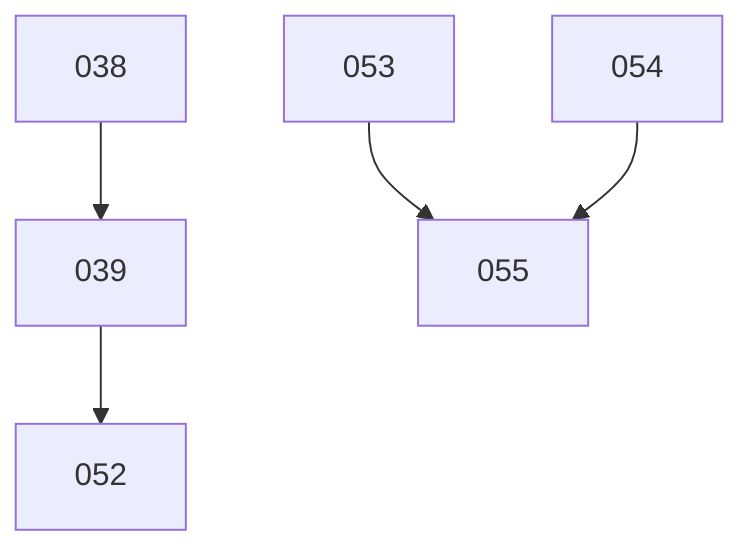

# Slice run DAG

Produce and maintain **`<spec-repo>/slices/DAG.md`** — a check-off **lane plan** that
schedules every pending slice across the operator's parallel `/run-slice` sessions, plus the
dependency graph and the per-slice analysis behind it. Argument (optional): the number of lanes
(default **3**).

`<spec-repo>` is the path in your `CLAUDE.md`'s `Spec repo:` line; a slice's subprojects are the
components in the target repo's `.kubecoder/project.yaml` (`kc project list`).

The operator works off **one thing**: a grid of checkboxes, one column per session, that says
which slices may run together. The plan honours every hard ordering requirement and packs the
lanes to **minimise merge work** (it does not try to eliminate it). The graph and the per-slice
inventory exist so the plan can be **re-derived without re-research** — change the lane count,
move a slice, or re-pack, and everything needed is already on the page.

## What this skill is — and isn't

- It **schedules**; it does not run anything. It never starts `/run-slice`.
- It **always processes every pending slice.** There is no "skip this one" — a slice the operator
  doesn't want in this round is removed by **moving its folder** to `slices/deferred/` (or a
  `slices/delayed/` they create) and re-running; the skill never silently drops a pending slice.
  If the operator complains that a slice is in the plan, the answer is "move its folder out," not
  "leave it out of the table."
- It is **incremental.** An existing `DAG.md` is the cache: re-runs reuse its analysis, add rows
  for new slices, drop rows for slices that are no longer pending, and preserve the operator's
  check-offs. It does **not** overwrite from scratch.

## Procedure

### Phase 1 — Enumerate the pending slices (the filesystem is the truth)

```bash
ls -d <spec-repo>/slices/[0-9][0-9][0-9]_*/
```

These — and only these — are pending. Anything under `slices/completed/`, `slices/deferred/`,
`slices/cancelled/`, or `slices/archive/` is **out**. The README `## Pending` list is a convenience,
not the source of truth: if disk and README disagree, **disk wins** (a slice may have been authored
or moved since the README was last touched).

### Phase 2 — Load the existing DAG.md (the cache)

If `<spec-repo>/slices/DAG.md` exists, read it and parse the **Inventory** table into one
record per slice (`subprojects`, `needs`, `gate`, `scope`) plus the current **Lane plan** (its
check-off state and cell positions). Then reconcile against Phase 1:

- **Carry over** — a row whose slice is still pending is kept **verbatim**. Do **not** re-read its
  files; its analysis is already captured. This is what keeps re-runs cheap.
- **Drop** — a row whose slice is no longer pending is removed, along with its graph edges. A
  `needs` that pointed at a dropped (completed) slice is now **satisfied** — delete that edge.
- **New** — a pending slice with no row yet goes to Phase 3 (the only slices that cost tokens).

On the first run there is no `DAG.md`, so every pending slice is "new".

### Phase 3 — Analyse only the new slices (cheap, and cached forever after)

For each **new** slice capture exactly four fields. Keep the cost down:

- **Subprojects** — from the **subfolders only**, never by reading files:
  `ls -d <spec-repo>/slices/<slice>/*/`. The folder names *are* the subprojects touched — the
  target repo's components (the names `kc project list` reports). This is the entire merge-conflict
  surface; it is free.
- **Scope** — one short line, lifted from the slice's `## Pending` entry in
  `<spec-repo>/README.md` (one read covers all slices).
- **Needs** — the slice numbers that **must run before** this one (hard ordering). Take what the
  README one-liner states ("after 049 + 047", "must precede D-S4", "run order 038 → 039 → 052",
  "depends on 046's post-state"); where it is silent or ambiguous, read that slice's `slice.md`
  (older slices may still use `overview.md`), targeting the ordering signal (grep for
  `depends|after|before|must run|precede|sequence|run order|prerequisite|blocked`). A `needs` is a
  slice that must be **done first**, not merely related.
- **Gate** — an external blocker that must clear before the slice can run at all (e.g. 055's
  *esp-idf spike* ⛔ RUN GATE; an operator action; a secret to mint). Short text, or `—`.

When several slices are new, dispatch **parallel `Explore` agents** — one tight brief per slice
that returns *only* `{subprojects, needs, gate, scope}` — so the overview reads stay out of this
session's context. Record nothing you can recompute: **do not** store merge edges; they are derived
from the subproject sets at plan time.

### Phase 4 — Build the plan (pure reasoning, zero file reads)

Everything below runs off the reconciled inventory alone. See **How to assign lanes**. Default to
the lane count in the argument, else **3**.

### Phase 5 — Write DAG.md and commit

Write `<spec-repo>/slices/DAG.md` in the format below. **Preserve every `[x]`** the operator
had ticked for a carried-over slice, and keep carried-over slices in their existing cells where the
constraints still allow (minimise churn — see the algorithm). Then commit it to the specs repo
(stage only `slices/DAG.md`), per the commit-as-you-go convention. This is a quick skill; no push
notification.

## The DAG.md format

Four sections. The **Lane plan** is the only thing the operator acts on; the rest exists so the
plan can be rebuilt without re-research.

````markdown
# Slice run DAG

_Updated <DATE> · <L> lanes · <K> pending slices. Re-run /slice-dag after slices land or change._

## Lane plan

| Lane 1  | Lane 2  | Lane 3  |
| ------- | ------- | ------- |
| [ ] 045 | [ ] 046 | [ ] 047 |
| [ ] 048 | [ ] 049 | -       |

- Finish a **row** before starting the next — each row is a barrier wave, so every slice runs
  only once everything above it is checked off (that is what guarantees the ordering).
- Each **column** is one of your parallel sessions; a `-` is a lane left idle that wave.
- `⛔ 055` means the slice has an unresolved **gate** (see *Hotspots & gates*) — clear it first.

## Inventory

The cached analysis — re-runs reuse these rows and only analyse slices not already listed. No
names in the lane plan, but here scope is fine.

| Slice | Subprojects                          | Needs   | Gate              | Scope                              |
| ----- | ------------------------------------ | ------- | ----------------- | ---------------------------------- |
| 045   | worker                               | —       | —                 | home / github-auth robustness      |
| 046   | contracts, controller                | —       | —                 | per-env storage layout             |
| 052   | bot, contracts, controller, worker   | 039     | —                 | rename environments                |
| 055   | contracts, controller, worker        | 053,054 | esp-idf spike     | tool-container parity (keystone)   |

## Graph



Only **hard ordering** (`needs`) edges are drawn. Merge relationships are not edges — they are
derived from the shared subprojects in the inventory.

## Hotspots & gates

- **Subproject touch counts** (merge pressure): `<component> ×N, …` for each component.
- **Codegen/drift-gated component** — if the project has one (e.g. a shared contracts package that
  regenerates across languages), two slices touching it concurrently is the costliest merge there
  is; never share a wave between two unless forced.
- **Gates:** `<slice> — <external blocker that must clear before /run-slice>`. <others…>
- **Lane rationale:** brief notes on any non-obvious placement, so a re-pack keeps the intent.
````

## How to assign lanes

The lane plan is a **schedule**, derived by reasoning over the inventory — not code. Inputs:
the nodes, the `needs` edges, each slice's subproject set, the gates, and the lane count `L`.

**Two kinds of relationship:**

- **needs (hard).** B needs A ⟹ A must be in an **earlier wave** than B. Non-negotiable.
- **merge (soft).** Two slices that **share a subproject** create merge work if they run in the
  same wave (concurrent sessions, two diffs to the same area). Avoid it where the schedule allows;
  accept it where avoiding it would strand the plan. Weight by the shared subproject: a
  codegen/drift-gated component is severe; a component touched by most slices makes some overlap per
  wave unavoidable — don't stall the plan chasing zero. Compute touch-counts from the inventory
  and treat the **hottest shared subproject** as the strongest serialise signal.

**Packing (default L = 3):**

1. **Layer by needs.** `earliest_wave(s) = 1` if it has no pending needs, else
   `1 + max(earliest_wave of each pending slice it needs)`. (Completed needs were dropped in
   Phase 2, so they don't count.)
2. **Order** slices by `(earliest_wave asc, number of dependents desc, slice number)` — so
   unblockers go early.
3. **Place greedily, wave by wave**, ≤ `L` slices per wave. For each slice, its earliest legal
   wave is `max(earliest_wave, 1 + last wave of any needed slice already placed)`. Put it in the
   earliest legal wave that has a free lane **and** shares no subproject with what's already in that
   wave. If every legal+free wave clashes, prefer to push the slice one wave later when that buys a
   clash-free row cheaply; otherwise place it and accept the merge (the goal is *minimise*, not
   *eliminate*). Never put two `contracts` slices in the same wave unless there is genuinely no
   alternative — say so in the rationale when you do.
4. **Serialise heavy overlaps in one lane.** When two slices overlap a lot (shared `contracts`, or
   several shared subprojects) and neither needs the other, prefer the **same lane in consecutive
   waves** (sequential in one session = zero cross-session merge) over the same wave.
5. **Gates.** A gated slice is still placed (every pending slice appears), marked `⛔`, and pushed
   late / off the critical path where possible; note the gate in *Hotspots & gates*.
6. **Idle lanes** are `-`.

**On update (re-pack):** keep carried-over slices in their existing cells where constraints still
allow, slot new slices into free cells or new waves, and **don't reshuffle a stable plan for a
marginal merge gain**. Preserve every `[x]`. If a `needs` forms a cycle, that's an authoring error —
stop and tell the operator rather than inventing an order.

## Keeping token cost down

The expensive part is reading slice docs; everything here is built so you do it **once per slice,
ever**:

- **Subprojects from `ls`, never from file contents.** The merge analysis is free.
- **Scope and most `needs` from the README `## Pending` block** — one read for all slices.
- **Deep-read a `slice.md` only for a *new* slice**, only for `needs`/gate, and only where the
  README is silent — via a parallel `Explore` agent that returns just the four fields, so the read
  never enters this session's context.
- **Carried-over slices are never re-read.** Their inventory rows are the cache.
- **Re-packing (different lane count, a manual edit, a moved slice) is pure reasoning** over the
  existing `DAG.md` — no file reads at all. That is the whole point of keeping the inventory and the
  graph on the page.

## Key principles

- **The table is the product.** Checkboxes, slice numbers, `-` for idle, no names, no backticks.
  Everything else serves rebuilding it.
- **Disk decides what's pending; the inventory caches the rest.** Reconcile against the folders,
  reuse cached rows, never overwrite blind.
- **Honour every `needs`; minimise — don't forbid — merge.** Ordering is a hard constraint; merge
  is a cost to push down, not a wall.
- **Every pending slice is in the plan.** Want one out? Move its folder, then re-run.
- **The page must be self-sufficient.** A re-pack at any lane count needs nothing but `DAG.md`.
